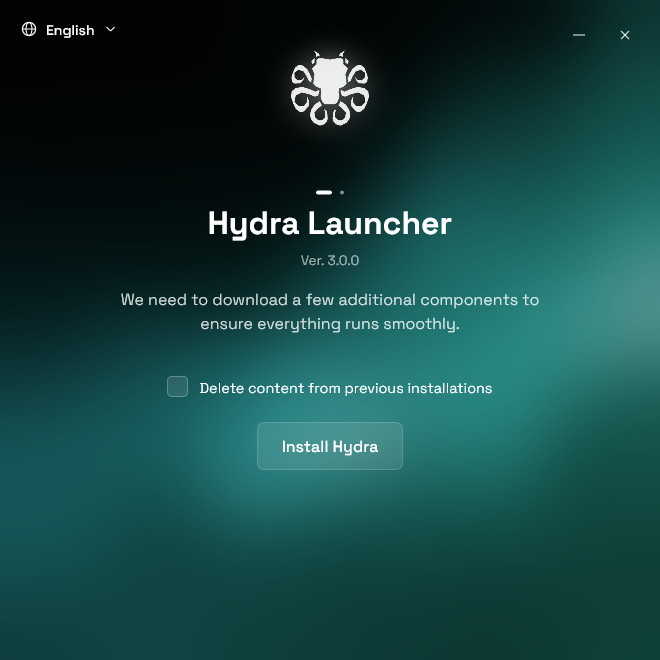

<div align="center">

[](https://github.com/hydralauncher/hydra)

  <h1 align="center">Hydra Installer</h1>

  <p align="center">
    <strong>The quickest way to get <a href="https://github.com/hydralauncher/hydra">Hydra Launcher</a> on Windows. One small app that downloads the latest Hydra release and starts the setup for you.</strong>
  </p>

[](https://github.com/hydralauncher/hydra-installer/actions)
[](https://github.com/hydralauncher/hydra-installer/releases)



</div>

## Download

1. Download `hydra-installer.exe` from the [latest release](https://github.com/hydralauncher/hydra-installer/releases/latest).
2. Run it and click **Install Hydra**.

That's it. The installer finds the newest version of Hydra, downloads it and opens the setup.

Requires Windows 10 or 11 (64-bit).

## Features

- **Always up to date**: downloads the latest Hydra release every time, so you never install an old version
- **Tiny and self-contained**: a single ~5 MB file, with nothing else to install
- **Clean reinstall**: optionally move data from a previous Hydra installation to the Recycle Bin before installing, so you can still restore it
- **Speaks your language**: English, Portuguese, Russian and Spanish, picked from your Windows settings
- **Helpful errors**: if something goes wrong (no internet, low disk space, Hydra still open), it tells you what happened and how to fix it
- **Runs anywhere**: works on any PC, even without a dedicated graphics card

## Translations

Want to see the installer in your language? Translations are simple JSON files in [`assets/locales`](assets/locales). See [CONTRIBUTING.md](CONTRIBUTING.md#adding-a-language) for how to add one.

## Build from source and contributing

You need [Rust](https://rustup.rs) and the Visual Studio C++ Build Tools on Windows:

```powershell
cargo build --release
```

Everything else, including tests, debug flags and how the code is organized, is in [CONTRIBUTING.md](CONTRIBUTING.md).

## Contributors

<a href="https://github.com/hydralauncher/hydra-installer/graphs/contributors">
  
</a>
